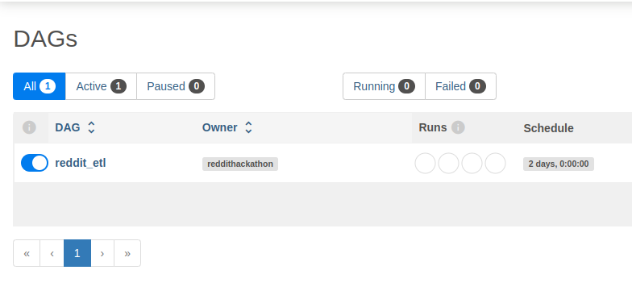

# reddit_bootcamp
To run the application you need [docker](https://www.docker.com/).
Install docker on your machine. This should also install `docker compose`.

## How to use the Reddit API
The script that fetches data from given subreddits can be found under `scripts/extract_data.py`.    
It uses the `praw` library to interact with the Reddit API.    
Here's how to create the needed credentials:
1. Go to: `https://www.reddit.com/prefs/apps/`.
2. Click the `create app` button.
3. Give the app with the following settings, change if needed: 
4. Copy the client id and client secret into the `.env` file, it's in the same folder as the `extract_data.py` script.

## Running the Application with Airflow
Step 1: Start Airflow
To start the application, use Docker Compose to spin up the Airflow services: 
docker compose up -d` 
This command will run the Airflow web server, scheduler, and other necessary components in the background.

Step 2: Access the Airflow Web UI
Once the services are up and running, you can access the Airflow web UI by navigating to http://localhost:8080 in your web browser. You should see a screen similar to this:

Step 3: Enable the DAG
To start the data extraction process:

Go to the "DAGs" section in the Airflow UI.
Find your DAG (e.g., reddit_etl).

Turn on the toggle button to enable the DAG

Step 4: Trigger the DAG Manually
If you want to run the DAG immediately:

Click on the name of the DAG (reddit_etl).
Click on the "Trigger DAG" button to start the process manually.

Step 5: Monitor and View Logs
To monitor the progress of the DAG execution:

Go back to the "DAGs" section.
Click on the DAG name to view the task instances.
Click on the logs icon to see the detailed logs for each task instance

Here, you will find detailed logs showing the execution steps, including data extraction, transformation, and loading stages.

